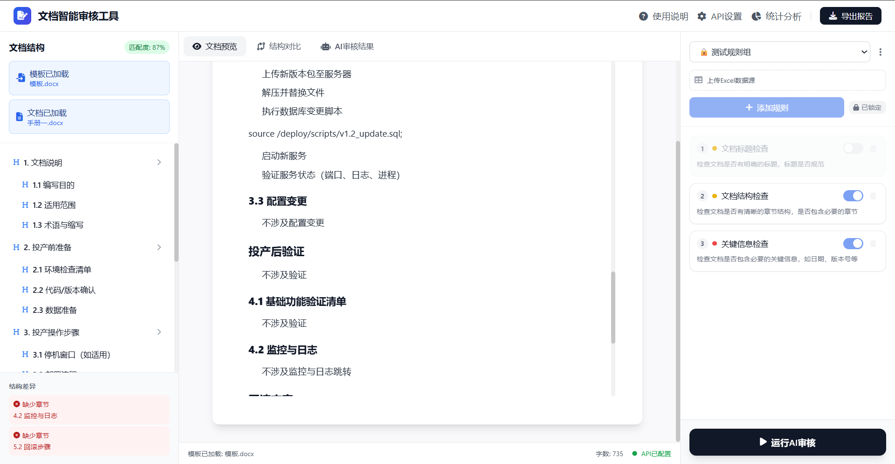
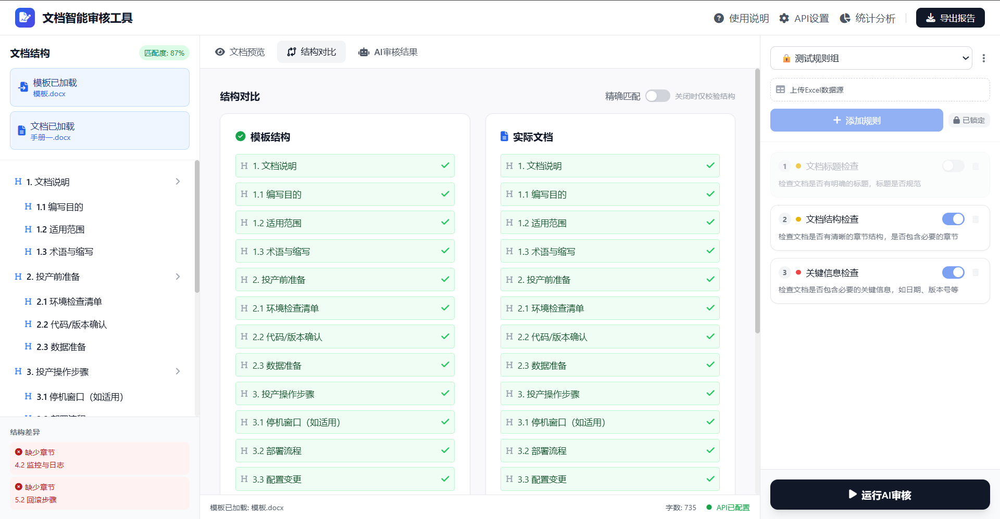

# SmartDoc AI - 智能文档审核系统

基于 Spring Boot + 原生前端实现的智能文档审核工具，支持文档结构对比、AI 内容审核和统计分析。



## 功能特性

### 文档结构对比
上传模板文档与待审文档，自动提取章节结构并进行智能匹配对比。

- 支持模糊匹配和精确匹配两种模式
- 精确匹配下可对比章节内容相似度
- 结构差异一目了然，快速定位缺失或多余章节



### AI 内容审核
基于自定义规则，AI 智能分析文档内容并给出修改建议。

- 支持多套规则组管理
- 自然语言描述审核规则
- Excel 数据源动态注入
- 批量审核与结果导出


### 规则组管理
- 新建、编辑、删除规则组
- 导入/导出规则（JSON 格式）
- 密码上锁保护，防止误修改


### 统计分析
全局调用统计，按规则组/规则筛选不准确反馈详情及原因。


### 审核结果反馈
每条审核结果可标记"准确/不准确"，帮助持续优化审核规则。


## 项目结构

```
ai-doc-check/
├── backend/                      # Spring Boot 后端服务
│   ├── src/main/java/            # Java 源码
│   │   └── com/smartdoc/
│   │       ├── config/           # 配置类（异步、加密、Web、MyBatis-Plus）
│   │       ├── controller/       # 控制器（审核、反馈、模板、规则组等）
│   │       ├── dto/              # 数据传输对象
│   │       ├── entity/           # 实体类
│   │       ├── exception/        # 全局异常处理
│   │       ├── mapper/           # MyBatis-Plus 映射
│   │       ├── service/          # 业务逻辑层
│   │       └── template/         # 模板管理
│   ├── src/main/resources/       # 配置文件与静态资源
│   │   ├── application.yml       # 主配置
│   │   ├── application-dev.yml   # 开发环境配置
│   │   ├── application-prod.yml  # 生产环境配置
│   │   ├── db/                   # SQL 脚本
│   │   └── prompts/              # AI 提示词模板
│   └── pom.xml                   # Maven 配置
├── frontend/                     # 前端静态文件
│   ├── js/                       # JavaScript 模块
│   │   ├── api-client.js         # API 请求封装
│   │   └── ui-helpers.js         # UI 工具函数
│   ├── libs/                     # 第三方库
│   ├── app.js                    # 主应用逻辑
│   ├── index.html                # 入口页面
│   └── styles.css                # 样式文件
└── README.md                     # 本文件
```

## 技术栈

### 后端
| 组件 | 版本 |
|------|------|
| JDK | 1.8 |
| Spring Boot | 2.7.18 |
| MyBatis-Plus | 3.5.3.1 |
| MySQL | 8.0+ |
| Apache POI | 5.2.3（Word 文档解析） |
| Apache PDFBox | 2.0.29（PDF 解析） |
| Apache Tika | 2.9.1（文档解析） |

### 前端
| 组件 | 用途 |
|------|------|
| 原生 JavaScript | 无框架依赖 |
| Tailwind CSS | 样式框架 |
| Mammoth.js | 浏览器端 Word 解析 |
| PDF.js | 浏览器端 PDF 解析 |
| SheetJS | Excel 数据导入 |

## 快速开始

### 1. 环境准备

- JDK 1.8+
- Maven 3.x
- MySQL 8.0+

### 2. 数据库初始化

```sql
CREATE DATABASE smartdoc DEFAULT CHARACTER SET utf8mb4;
USE smartdoc;
source backend/src/main/resources/db/init.sql;
```

### 3. 配置数据库连接

编辑 `backend/src/main/resources/application.yml`:

```yaml
spring:
  datasource:
    url: jdbc:mysql://localhost:3306/smartdoc?useUnicode=true&characterEncoding=utf8&useSSL=false&serverTimezone=Asia/Shanghai
    username: your_username
    password: your_password
```

### 4. 构建与运行

**开发环境:**
```bash
cd backend
mvn clean install -DskipTests
mvn spring-boot:run
```

**生产环境:**
```bash
cd backend
mvn clean package -DskipTests

# Linux 启动
chmod +x start.sh
./start.sh

# Windows 启动
start.bat
```

服务启动后访问: `http://localhost:8080`

## 使用指南

### 配置 API
点击右上角「API设置」，填写 API 密钥和端点地址。

### 上传文档
1. 点击「选择模板」上传模板文档（可选）
2. 点击「上传待审文档」选择要审核的文件
3. 支持的格式：DOC、DOCX、PDF、TXT、MD

### 运行审核
1. 在右侧面板添加审核规则（自然语言描述）
2. 可选择上传 Excel 数据源动态注入数据
3. 点击「运行AI审核」开始智能审核

## 支持的相似度算法

### 标题匹配
- Jaccard 字符集相似度
- 层级匹配加权（+0.2）
- 关键词提取匹配（如"第一章"）

### 内容相似度
- 中文：`Jaccard × 0.8 + 长度比例 × 0.2 + 公共前缀奖励`
- 英文：单词级 Jaccard 相似度

## API 接口

| 方法 | 路径 | 描述 |
|------|------|------|
| GET | `/api/config/rules` | 获取所有规则组 |
| GET | `/api/config/rules/{groupId}` | 获取指定规则组 |
| POST | `/api/config/rules` | 创建规则组 |
| PUT | `/api/config/rules/{groupId}` | 更新规则组 |
| DELETE | `/api/config/rules/{groupId}` | 删除规则组 |
| GET | `/api/config/api` | 获取 API 配置 |
| PUT | `/api/config/api` | 更新 API 配置 |
| POST | `/api/audit` | 执行文档审核 |
| POST | `/api/audit/feedback` | 提交审核反馈 |
| GET | `/api/audit/grouped` | 获取分组审核结果 |
| GET | `/api/audit/records` | 获取审核工单记录 |
| POST | `/api/audit/check-review` | 检查审核状态 |
| POST | `/api/proxy` | AI 代理请求 |
| POST | `/api/template` | 上传模板文件 |
| GET | `/api/template/list` | 获取模板列表 |
| PUT | `/api/template/cache-control` | 更新模板缓存控制 |
| POST | `/api/audit/async` | 异步提交审核 |
| GET | `/api/audit/async/status` | 查询异步审核状态 |
| GET | `/api/stats/summary` | 获取统计数据概览 |
| GET | `/api/stats/inaccurate` | 获取不准确反馈详情 |
| PUT | `/api/config/rules/{groupId}/lock` | 上锁规则组 |
| POST | `/api/config/rules/{groupId}/unlock` | 解锁规则组 |

## 打包部署

```bash
cd backend
mvn clean package -DskipTests
```

生成 JAR: `target/smartdoc-backend-1.0.0.jar`

**启动方式:**
```bash
# 直接运行
java -jar target/smartdoc-backend-1.0.0.jar

# 使用启动脚本（推荐生产环境）
./start.sh    # Linux
start.bat     # Windows
```

**停止服务:**
```bash
./stop.sh     # Linux
stop.bat      # Windows
```

详细部署说明请参考 [backend/README.md](backend/README.md)

## 许可证

MIT License
